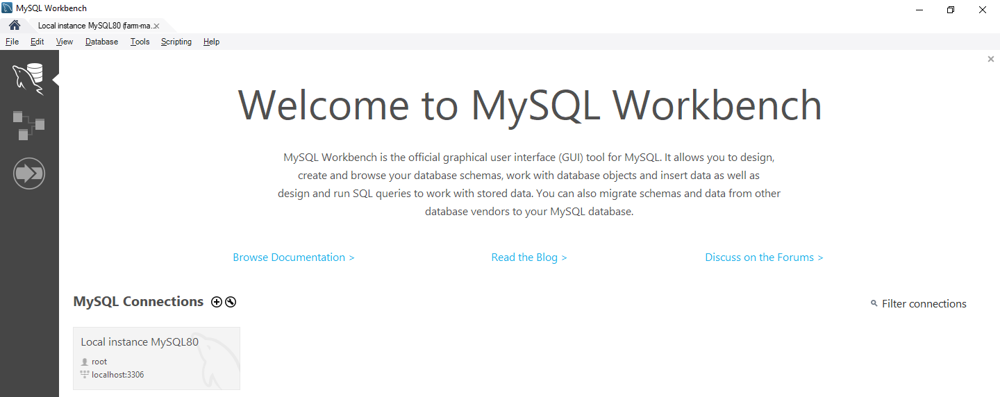
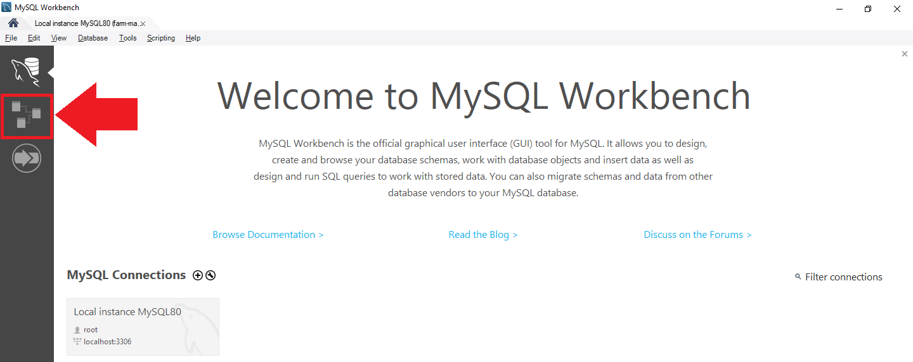
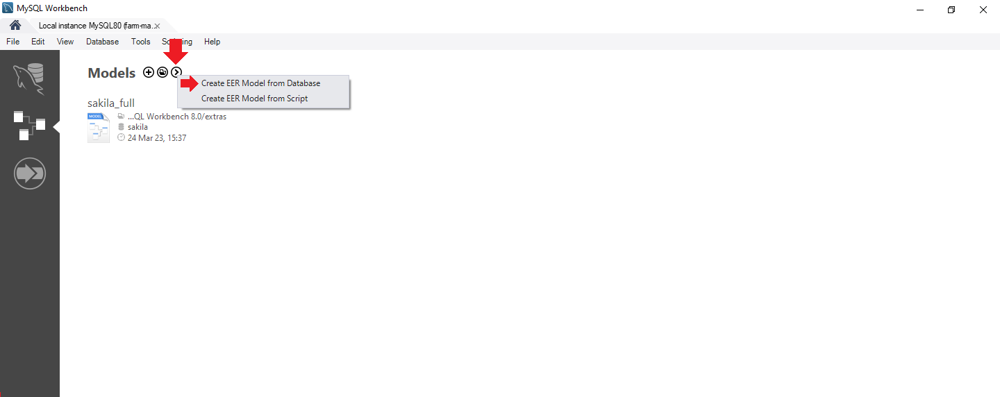
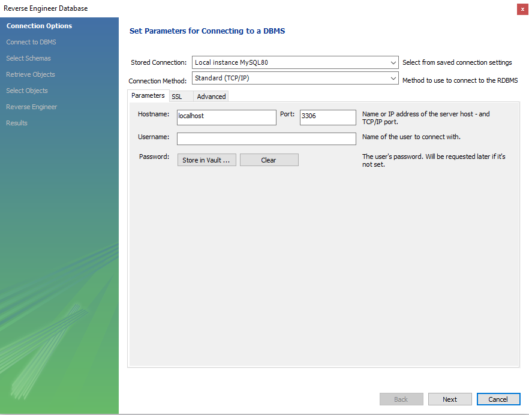
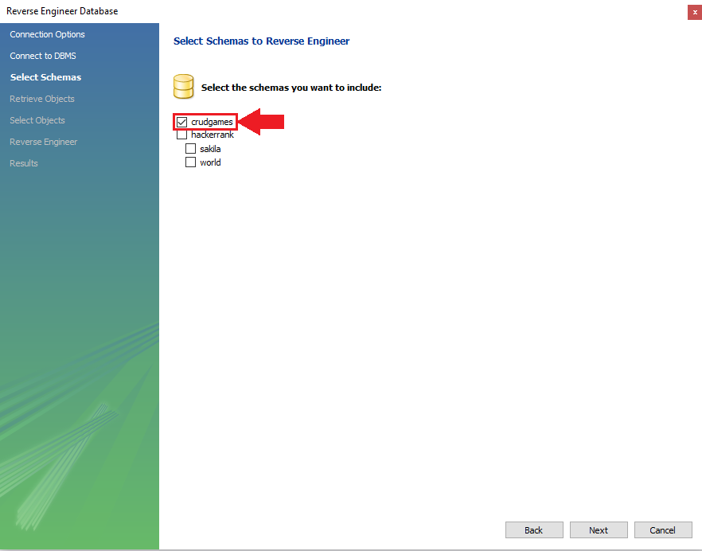

# Create a Diagram Model from Database with MySQL Workbench

This section will demonstrate how to create a diagram model from database with MySQL Workbench, step by step, using print screens.

## Requirements

-   [MySQL Workbench](https://dev.mysql.com/downloads/workbench/)

## Step-by-Step

1. Open your My SQL Workbench.

2. Click on Model Creation menu.

3. Click on the model creation menu, and then click on **CREATE EER MODEL FROM DATABASE**.

4. Follow the steps, checking every screen, until you get to the selection database screen.

5. Once you arrive in the selection database screen, select the database and continue the steps.

6. Your Diagram is created, now you can save or change it.
